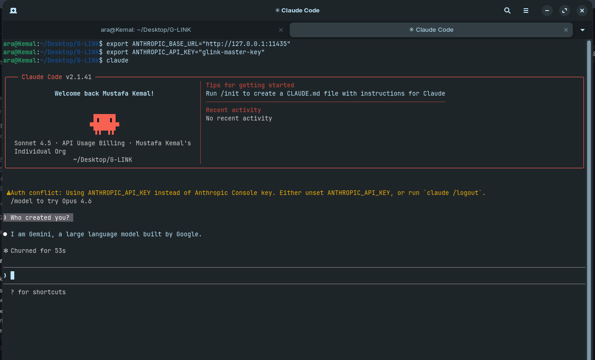

<div align="center">

<pre>
╔═══════════════════════════════════════════════════════════════════════════════╗
║                                                                               ║
║     ______            __        _____   __   __   __   _  __                  ║
║    / ____/           / /       /  _/ | / /  / /  / /  / |/ /                  ║
║   / / __   ______   / /        / / |  / /  / /  / /  /    /                   ║
║  / /_/ /  /_____/  / /___    _/ /  | / /  / /__/ /  / /  /                    ║
║  \____/           /_____/   /___/  |_/    \____/  /_/ |_/                     ║
║                                                                               ║
║  "The Brain of Gemini, The Hands of Claude."                                 ║
║  Bridge Claude Code CLI to Google Gemini 1.5 Pro (2M Context)                 ║
║                                                                               ║
║  Created by: Mustafa Kemal Çıngıl                                            ║
║                                                                               ║
╚═══════════════════════════════════════════════════════════════════════════════╝
</pre>

<strong>🚀 Unlock 2 Million Context for Claude Code CLI using Gemini AI Studio</strong>

<br/><br/>

[](#)
[](LICENSE)
[](#)

</div>

<br/>

---

## ✨ Features

**G-LINK** is a high-performance local proxy that intercepts requests from the **Claude Code CLI** and reroutes them to **Google Gemini 1.5 Pro** via AI Studio. It allows you to use Claude's autonomous terminal capabilities with Gemini's massive 2-million token context window.

| Feature | Description |
|--------|-------------|
| 🧠 **2M Context** | Bypass Anthropic's context limits by leveraging Gemini 1.5 Pro's massive memory. |
| 🪄 **Magic MCP** | Perfectly compatible with Model Context Protocol for complex React/Next.js components. |
| 💰 **Zero Cost** | Use your Google AI Studio API key to avoid expensive Anthropic credit usage. |
| ⚡ **Async Proxy** | Fast, local-first FastAPI bridge with minimal latency. |
| 🤖 **Hybrid Power** | Claude's agentic tool-use logic + Gemini's reasoning and speed. |
| 🛠️ **Standalone CLI** | Includes a built-in terminal interface for direct Gemini interaction. |

---

## 🚀 Quick Start

### 1. Installation

```bash
git clone https://github.com/MustafaKemal0146/G-LINK.git
cd G-LINK
pip install -r requirements.txt
```

### 2. Launch the Bridge

In your first terminal, start the G-LINK proxy:

```bash
python3 glink_proxy.py
```

### 3. Connect Claude Code

In a second terminal, redirect Claude to your local bridge:

```bash
export ANTHROPIC_BASE_URL="http://127.0.0.1:11435"
export ANTHROPIC_API_KEY="glink-master-key"
claude
```

---

## 🪄 Magic MCP & Next.js

G-LINK is specifically optimized for large-scale **Next.js** and **React** development. By bridging to Gemini, you can feed entire component libraries and documentation into the context, allowing the agent to generate pixel-perfect UI elements and complex logic without "forgetting" earlier instructions.

---

## 🤖 Hybrid Identity

When using **G-LINK**, you are effectively giving **Claude's hands** (the CLI tools and terminal agentic logic) the **brain of Gemini**. 

If you ask the agent "Who designed you?" while connected through the bridge, it will correctly identify itself as a model trained by **Google**, as it is now powered by **Gemini 1.5 Pro**. This hybrid setup gives you the best of both worlds: Claude's superior terminal orchestration and Gemini's massive context window.

<div align="center">
  
  <p><em>Example: Gemini 1.5 Pro responding through the Claude Code CLI interface.</em></p>
</div>

---

## 📁 Project Structure

```
G-LINK/
├── glink_proxy.py    # The FastAPI Bridge (Anthropic -> Gemini)
├── main.py           # Standalone G-LINK Terminal Interface
├── requirements.txt  # Core dependencies
└── README.md         # Documentation
```

---

## 🧔 Author

**Mustafa Kemal Çıngıl**  
*AI Researcher & Software Architect*  
[mustafakemalcingil.site](https://mustafakemalcingil.site) | [GitHub](https://github.com/MustafaKemal0146)

---

## 📄 License

MIT — See [LICENSE](LICENSE) for details.

---

<div align="center">

**G-LINK — The Brain of Gemini, The Hands of Claude.**

</div>
